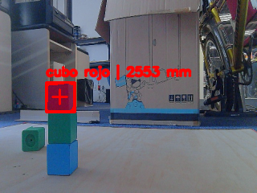
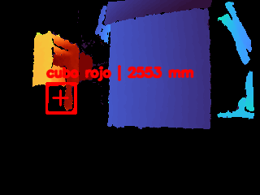
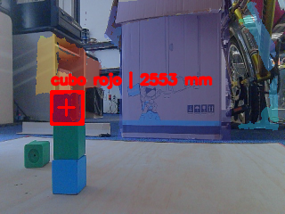

# Visión RGB-D con Orbbec Astra+
## Detección de cubo rojo, medición de profundidad y empalme RGB-D

Este repositorio contiene una aplicación de visión por computadora desarrollada para trabajar con una cámara **Orbbec Astra+**, utilizando captura RGB, lectura de profundidad, alineación RGB-D, segmentación por color y generación de evidencias visuales.

El sistema está orientado a pruebas iniciales de percepción visual para asistencia a la conducción, enfocándose en la detección de un objetivo específico, la medición de distancia mediante profundidad y la calibración visual entre la imagen RGB y el mapa de profundidad.

---

## Descripción general

La aplicación principal permite capturar información visual mediante una cámara RGB y un sensor de profundidad. A partir de estos datos, el sistema identifica un **cubo rojo** dentro de la escena usando técnicas clásicas de visión por computadora.

Esta versión **no utiliza YOLO** como detector principal. La detección se realiza mediante:

* Segmentación por color en HSV.
* Detección de contornos.
* Análisis de forma.
* Análisis de textura.
* Validación con profundidad alineada.
* Medición de distancia del objetivo.

---
## Uso de bordes Canny

El sistema utiliza bordes Canny como herramienta de apoyo dentro del procesamiento visual.

Canny se emplea principalmente para:

- Resaltar contornos en la imagen RGB.
- Apoyar la validación de la forma del cubo rojo.
- Comparar bordes entre RGB y profundidad durante el empalme automático depth → RGB.
- Mejorar la estimación de alineación entre ambos sensores.

La detección principal del objetivo no depende únicamente de Canny, sino de la combinación de segmentación por color rojo, análisis de contornos, forma, textura y profundidad alineada.

---

## Objetivo

Desarrollar un sistema de visión RGB-D con Orbbec Astra+ capaz de detectar un objetivo visual específico, estimar su distancia mediante profundidad y generar evidencias reales del funcionamiento del sistema.

---

## Características principales

El sistema incluye:

* Captura de imagen RGB.
* Captura de profundidad mediante OpenNI.
* Alineación de profundidad al plano RGB.
* Detección de un cubo rojo mediante segmentación por color.
* Detección de contornos y análisis de forma.
* Estimación de textura del objetivo.
* Medición de distancia usando profundidad alineada.
* Filtros temporales tipo Kalman para suavizar RGB y profundidad.
* Visualización de profundidad con mapa de color.
* Ensamble visual RGB + profundidad.
* Panel de datos del sensor y del objetivo.
* Análisis básico de piso azul como zona transitable.
* Captura automática de evidencias cuando se detecta el objetivo.
* Calibración de empalme depth → RGB mediante puntos manuales.

---

## Funcionamiento general

```text
Captura RGB
    ↓
Captura de profundidad
    ↓
Suavizado temporal con Kalman
    ↓
Alineación de profundidad al plano RGB
    ↓
Segmentación del color rojo
    ↓
Detección de contornos y forma
    ↓
Validación con profundidad
    ↓
Estimación de distancia del objetivo
    ↓
Visualización y guardado de evidencias
```

---

## Detección del objetivo

El objetivo actual del sistema es un:

```text
cubo rojo
```

La detección se realiza mediante segmentación en el espacio de color HSV. 
Después se aplican operaciones morfológicas para limpiar la máscara y se buscan contornos candidatos.

Para seleccionar el objetivo, el sistema considera:

* Área mínima del contorno.
* Forma aproximada del objeto.
* Bordes.
* Textura.
* Profundidad válida dentro de la región detectada.

Si el objeto cuenta con suficiente información de profundidad, el sistema calcula su distancia aproximada respecto al sensor.

---

## Medición de profundidad

La distancia del objetivo se calcula usando la profundidad alineada al plano RGB.

El sistema toma los valores de profundidad dentro del contorno detectado y calcula una mediana para reducir el efecto de valores atípicos o ruido.

También se registra la cantidad de píxeles válidos de profundidad dentro del objetivo, lo cual permite estimar si la medición es confiable o no.

---

## Empalme RGB + profundidad

El sistema permite trabajar con una imagen de profundidad proyectada sobre el plano RGB. Para esto se contempla:

* Alineación manual mediante desplazamiento y escala.
* Alineación automática por bordes.
* Alineación mediante homografía.
* Alineación calibrada 3D, si se cuenta con parámetros intrínsecos y extrínsecos.

El archivo `calibrar_empalme_depth_rgb.py` permite realizar una calibración visual mediante puntos equivalentes entre RGB y profundidad. El programa congela una escena, permite seleccionar puntos en ambos paneles y calcula una homografía para mejorar el empalme depth → RGB.

---

## Calibración de empalme depth → RGB

Para ejecutar el calibrador visual:

```powershell
python calibrar_empalme_depth_rgb.py
```

```text
orbbec_sencillo_config.json
```

---


## Panel de visualización

Durante la ejecución, la aplicación muestra cuatro paneles principales:

1. **Sensor RGB + Kalman**
   Imagen RGB suavizada con detección dibujada.

2. **Sensor profundidad alineado**
   Mapa de profundidad visualizado con colores.

3. **Empalme RGB + profundidad**
   Ensamble visual entre la imagen RGB y la profundidad alineada.

4. **Datos reales del objetivo y sensores**
   Panel con información del sensor, profundidad, estado del piso y datos del objetivo detectado.

---

## Evidencias de pruebas

A continuación se muestran algunas capturas obtenidas durante las pruebas del sistema.

### Captura RGB



### Profundidad



### Empalme RGB + profundidad




---

## Captura automática de evidencias

Cuando el sistema detecta el cubo rojo, puede guardar capturas automáticamente en la carpeta configurada.

Por defecto, las evidencias se guardan en:

```text
capturas_orbbec_sencillo/
```

Las capturas generadas incluyen:

* Imagen RGB con detección.
* Imagen de profundidad.
* Ensamble RGB + profundidad.

---

## Configuración

El sistema utiliza el archivo:

```text
orbbec_sencillo_config.json
```

## Instalación

Instala las dependencias necesarias con:

```powershell
python -m pip install -r requirements.txt
```

---

## Ejecución

Para iniciar la aplicación principal:

```powershell
python orbbec_sencillo.py
```

Para ejecutar el calibrador de empalme RGB-D:

```powershell
python calibrar_empalme_depth_rgb.py
```
---

## Consideraciones

* Esta versión no utiliza YOLO como detector principal.
* La detección se basa en color, forma, textura y profundidad.
* La distancia depende de la calidad de la alineación RGB-D.
* La lectura RGB y profundidad se realiza por ciclo de ejecución, no mediante sincronización hardware.
* Las capturas generadas sirven como evidencia de pruebas y como base para documentación posterior.
* La calibración puede mejorar la precisión de la medición de distancia y dimensiones.

---

## Autor

**Roode Saavedra Carrera**
Estancia de verano — CIC
Módulo de percepción visual con cámara Orbbec Astra+
